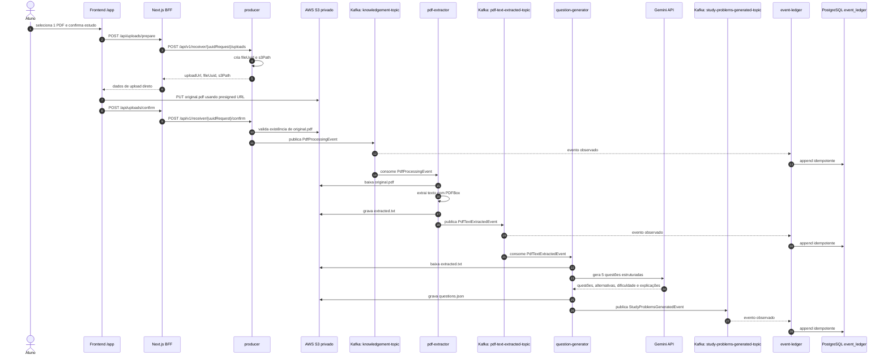

# Arquitetura Atual do Ratto


## Fluxo Principal



## Tópicos Kafka

| Tópico | Publicado por | Consumido por | Payload | Papel |
| --- | --- | --- | --- | --- |
| `knowledgement-topic` | `producer` | `pdf-extractor`, `event-ledger` | `PdfProcessingEvent` | Solicita processamento de um PDF já enviado ao S3. |
| `pdf-text-extracted-topic` | `pdf-extractor` | `question-generator`, `event-ledger` | `PdfTextExtractedEvent` | Informa que o texto foi extraído e está disponível no S3. |
| `study-problems-generated-topic` | `question-generator` | `event-ledger` no estado atual | `StudyProblemsGeneratedEvent` | Informa que as questões foram geradas e salvas no S3. No plano do `# Ratto.md`, este evento também alimenta a persistência de estudo no monólito modular. |
| `pdf-ingestion-errors` | `pdf-extractor`, `question-generator` | `event-ledger` | `PdfIngestionErrorEvent` | Registra falhas técnicas do processamento assíncrono com correlação ao evento de origem. |

## Convenção de Paths no S3

Todos os artefatos de um arquivo ficam na mesma pasta lógica:

```text
requests/{uuidUser}/{uuidRequest}/{fileUuid}/original.pdf
requests/{uuidUser}/{uuidRequest}/{fileUuid}/extracted.txt
requests/{uuidUser}/{uuidRequest}/{fileUuid}/questions.json
```

O evento Kafka carrega referências para esses caminhos, não o conteúdo dos documentos. O PDF, o texto extraído e o JSON final trafegam pelo S3; o Kafka carrega metadados, correlação, autoria, IDs e ponteiros para os artefatos.

## Observações do Estado Atual

- `api-gateway` é o único ingresso HTTP público de negócio em Compose, exposto em `localhost:3000`.
- O frontend usa BFF interno para preparar e confirmar uploads, mas o binário do PDF vai direto do navegador para o S3 via URL pré-assinada.
- `core-service` é o monólito modular atual e persiste projeções de perfil de usuário em `postgres-core`.
- `producer`, `pdf-extractor` e `question-generator` compõem a cadeia principal de microserviços do pipeline de PDFs.
- `event-ledger` está implementado para observar todos os tópicos e gravar eventos de forma append-only, mas seus serviços de Compose estão comentados no arquivo atual.
- `generics` centraliza contratos de eventos, modelos compartilhados e utilitários S3 usados pelos serviços Java.
